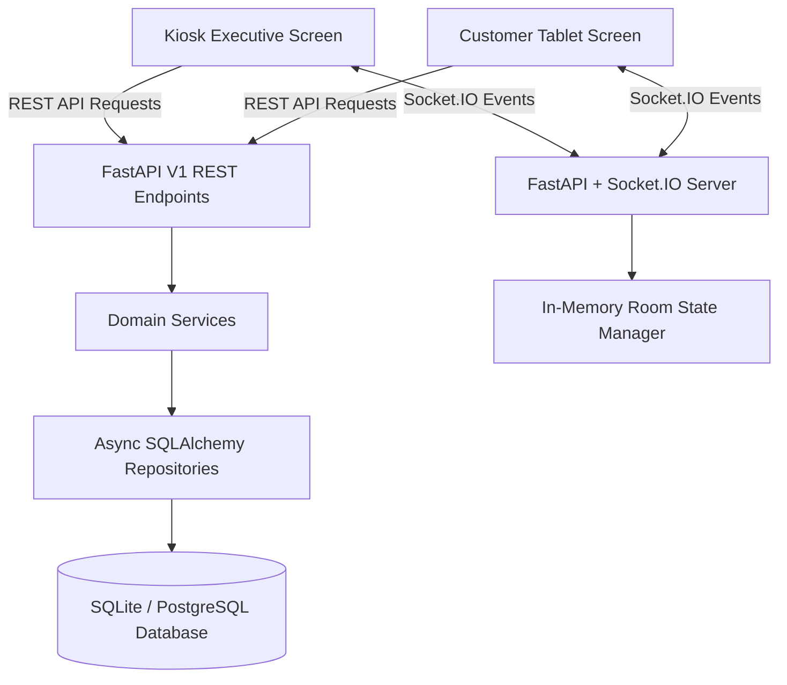

# Sales Kiosk Application

Production-ready, feature-modular **Real-Time Sales Kiosk Application** designed for high-end real estate sales galleries. Built with **FastAPI**, **SQLAlchemy 2.0 (Async)**, **Socket.IO**, **React**, **Vite**, **TypeScript**, **Zustand**, and **TailwindCSS**.

Designed for sales executives and client presentation suites to mirror screens live across devices (tablets, kiosks, desktop browsers) with real-time state sync and **race-condition safe atomic unit reservations**.

---

## 📋 Table of Contents

- [🌟 Key Features](#-key-features)
- [🏗️ System Architecture](#️-system-architecture)
- [🚀 Local Environment Setup](#-local-environment-setup)
  - [Prerequisites](#prerequisites)
  - [Backend Setup (Windows & macOS)](#1-backend-setup)
  - [Frontend Setup](#2-frontend-setup)
- [📡 API Endpoints Reference](#-api-endpoints-reference)
- [💻 Frontend Pages Reference](#-frontend-pages-reference)
- [⚡ WebSocket Events Contract](#-websocket-events-contract)
- [📄 OpenAPI / Swagger 3.0 Specification](#-openapi--swagger-30-specification)
- [🔒 Atomic Reservation & Concurrency Handling](#-atomic-reservation--concurrency-handling)
- [🧪 Real-Time Device Pairing Test Guide](#-real-time-device-pairing-test-guide)
- [🐳 Docker Deployment](#-docker-deployment)
- [🔧 Troubleshooting & FAQ](#-troubleshooting--faq)

---

## 🌟 Key Features

1. **Feature-Based Modular Architecture**:
   - Clean domain separation (`app/gallery`, `app/video`, `app/inventory`, `app/booking`, `app/websocket`).
   - Enterprise pattern separation (`router.py`, `service.py`, `repository.py`, `models.py`, `schemas.py`).
2. **Atomic Race-Condition Safe Unit Booking**:
   - Database-level transaction safety via conditional SQL updates: `UPDATE unit SET status='BOOKED' WHERE id=:id AND status='AVAILABLE'`.
   - Prevents double-booking across simultaneous sales executive requests (returns `409 Conflict`).
3. **Real-Time Multi-Device Room Synchronization**:
   - Bi-directional Socket.IO room sync (`sales-room-101`).
   - Synchronizes page navigation, tower selection, unit highlights, photo gallery lightbox state, video playback timestamps, and booking modals across all paired executive and customer tablets.
4. **Modern Dark Glassmorphism UI**:
   - Modern TailwindCSS styling with responsive design, Lucide icons, live search filters, stats widgets, and keyboard shortcuts (`Esc` key listeners).

---

## 🏗️ System Architecture



---

## 🚀 Local Environment Setup

### Prerequisites
- **Python**: `3.12+`
- **Node.js**: `18.0+` (with `npm`)
- **Git**

---

### 1. Backend Setup

#### 🪟 Windows (PowerShell / Command Prompt)

```powershell
# 1. Navigate to backend directory
cd backend

# 2. Create virtual environment
python -m venv venv

# 3. Activate virtual environment
# PowerShell:
.\venv\Scripts\Activate.ps1
# OR Command Prompt (cmd):
# .\venv\Scripts\activate.bat

# 4. Upgrade pip & install dependencies
python -m pip install --upgrade pip
pip install -r requirements.txt

# 5. Run Uvicorn development server
uvicorn app.main:combined_app --reload --port 8000
```

#### 🍎 macOS & 🐧 Linux (Terminal)

```bash
# 1. Navigate to backend directory
cd backend

# 2. Create virtual environment
python3 -m venv venv

# 3. Activate virtual environment
source venv/bin/activate

# 4. Upgrade pip & install dependencies
pip install --upgrade pip
pip install -r requirements.txt

# 5. Run Uvicorn development server
uvicorn app.main:combined_app --reload --port 8000
```

> 💡 **Note**: Database tables and seed data (3 Towers, 12 Units, 8 Gallery Images, 4 Videos) are automatically generated on server startup via lifespan triggers.

---

### 2. Frontend Setup

Open a **new terminal window/tab**:

```bash
# 1. Navigate to frontend directory
cd frontend

# 2. Install NPM dependencies
npm install

# 3. Start Vite local development server
npm run dev
```

- **Frontend URL**: `http://localhost:5173`
- **Backend Base API**: `http://localhost:8000/api/v1`
- **Interactive Swagger Docs**: `http://localhost:8000/docs`
- **ReDoc UI**: `http://localhost:8000/redoc`

---

## 📡 API Endpoints Reference

All REST API endpoints are prefixed with `/api/v1`.

| HTTP Method | Endpoint | Description | Request Payload / Params | Response Code | Tag |
| :--- | :--- | :--- | :--- | :--- | :--- |
| **GET** | `/` | Root API health status & version metadata | None | `200 OK` | Health |
| **GET** | `/api/v1/inventory` | Fetches all towers with nested apartment units | None | `200 OK` | Inventory |
| **GET** | `/api/v1/gallery` | Fetches high-res property gallery photo list | None | `200 OK` | Gallery |
| **GET** | `/api/v1/videos` | Fetches promotional property video catalog | None | `200 OK` | Videos |
| **POST** | `/api/v1/book` | Atomically reserves an available unit | `{ unit_id, customer_name, customer_email, customer_phone }` | `201 Created` / `409 Conflict` / `404 Not Found` | Booking |

---

## 💻 Frontend Pages Reference

| Page / Component | View Identifier | Key Components & Features | Description |
| :--- | :--- | :--- | :--- |
| **Inventory Showcase** | `inventory` | `TowerSelector`, `UnitGrid`, `UnitCard`, `BookingModal`, `StatsWidget` | Interactive inventory page displaying residential towers, unit floor plans, price filters, real-time availability tags, search, and direct unit booking modal. |
| **Media Gallery** | `gallery` | `CategoryFilter`, `ImageGrid`, `LightboxModal` | High-definition image showcase featuring category tab filters (Exterior, Interior, Amenities) and full-screen image lightbox sync. |
| **Video Theater** | `videos` | `VideoCard`, `CustomVideoPlayer` | Video showcase streaming HD project walkthroughs with synchronized play/pause/seek controls for multi-screen sync. |
| **Device Pairing Header** | Navbar (Global) | `QRModal`, `SessionLinkBanner` | Displays pairing status, quick session room ID trigger, live Socket.IO connection pulse indicator, and QR code modal for mobile/tablet pairing. |

---

## ⚡ WebSocket Events Contract

WebSocket connection endpoint: `http://localhost:8000/socket.io`

| Event Name | Direction | Payload Example | Purpose |
| :--- | :--- | :--- | :--- |
| `join_session` | Client ➔ Server | `{ "sessionId": "sales-room-101" }` | Joins a synchronized presentation room. |
| `sync_navigation` | Bi-directional | `{ "page": "gallery" }` | Syncs active tab across all paired devices. |
| `sync_tower` | Bi-directional | `{ "towerId": 2 }` | Syncs active tower selection. |
| `sync_unit` | Bi-directional | `{ "unitId": 5 }` | Syncs highlighted/selected property unit. |
| `sync_gallery` | Bi-directional | `{ "index": 3 }` | Syncs full-screen photo lightbox index. |
| `sync_video` | Bi-directional | `{ "isPlaying": true, "currentTime": 12.5 }` | Syncs video play state and timestamp. |
| `sync_booking_modal` | Bi-directional | `{ "isOpen": true, "unitId": 5 }` | Opens/closes booking dialog across screens. |

---

## 📄 OpenAPI / Swagger 3.0 Specification

FastAPI automatically serves interactive Swagger UI at **`http://localhost:8000/docs`**.

Below is the complete OpenAPI 3.0.3 YAML schema definition for integration with Postman, Swagger UI, or API gateways:

```yaml
openapi: 3.0.3
info:
  title: Sales Kiosk API
  description: Real-time Sales Kiosk backend API supporting real estate presentation and atomic unit booking.
  version: 1.0.0
paths:
  /:
    get:
      summary: Root Health Check
      operationId: root_get
      responses:
        '200':
          description: Successful Response
          content:
            application/json:
              schema:
                type: object
                properties:
                  status:
                    type: string
                    example: healthy
                  app:
                    type: string
                    example: Sales Kiosk API
                  version:
                    type: string
                    example: 1.0.0
  /api/v1/inventory:
    get:
      tags:
        - Inventory
      summary: Get Full Inventory
      description: Returns list of all towers along with their nested units.
      operationId: get_inventory_api_v1_inventory_get
      responses:
        '200':
          description: Successful Response
          content:
            application/json:
              schema:
                $ref: '#/components/schemas/InventoryRead'
  /api/v1/gallery:
    get:
      tags:
        - Gallery
      summary: Get Gallery Images
      description: Returns list of high-definition photo assets.
      operationId: get_gallery_api_v1_gallery_get
      responses:
        '200':
          description: Successful Response
          content:
            application/json:
              schema:
                type: array
                items:
                  $ref: '#/components/schemas/GalleryRead'
  /api/v1/videos:
    get:
      tags:
        - Videos
      summary: Get Video Catalog
      description: Returns list of promotional property showcase videos.
      operationId: get_videos_api_v1_videos_get
      responses:
        '200':
          description: Successful Response
          content:
            application/json:
              schema:
                type: array
                items:
                  $ref: '#/components/schemas/VideoRead'
  /api/v1/book:
    post:
      tags:
        - Booking
      summary: Book Unit
      description: Atomically reserves an available apartment unit. Prevents double-booking via atomic SQL updates.
      operationId: book_unit_api_v1_book_post
      requestBody:
        required: true
        content:
          application/json:
            schema:
              $ref: '#/components/schemas/BookingCreate'
      responses:
        '201':
          description: Unit successfully reserved.
          content:
            application/json:
              schema:
                $ref: '#/components/schemas/BookingRead'
        '404':
          description: Specified unit ID was not found.
        '409':
          description: Conflict — Unit has already been booked by another customer.

components:
  schemas:
    UnitRead:
      type: object
      required:
        - id
        - tower_id
        - unit_number
        - floor
        - bedrooms
        - bathrooms
        - area_sqft
        - price
        - status
      properties:
        id:
          type: integer
        tower_id:
          type: integer
        unit_number:
          type: string
        floor:
          type: integer
        bedrooms:
          type: integer
        bathrooms:
          type: integer
        area_sqft:
          type: number
        price:
          type: number
        status:
          type: string
          enum: [AVAILABLE, RESERVED, BOOKED]

    TowerRead:
      type: object
      required:
        - id
        - name
        - total_floors
        - units
      properties:
        id:
          type: integer
        name:
          type: string
        total_floors:
          type: integer
        units:
          type: array
          items:
            $ref: '#/components/schemas/UnitRead'

    InventoryRead:
      type: object
      required:
        - towers
      properties:
        towers:
          type: array
          items:
            $ref: '#/components/schemas/TowerRead'

    GalleryRead:
      type: object
      required:
        - id
        - title
        - category
        - image_url
      properties:
        id:
          type: integer
        title:
          type: string
        category:
          type: string
        image_url:
          type: string

    VideoRead:
      type: object
      required:
        - id
        - title
        - duration
        - video_url
        - thumbnail_url
      properties:
        id:
          type: integer
        title:
          type: string
        duration:
          type: string
        video_url:
          type: string
        thumbnail_url:
          type: string

    BookingCreate:
      type: object
      required:
        - unit_id
        - customer_name
        - customer_email
        - customer_phone
      properties:
        unit_id:
          type: integer
        customer_name:
          type: string
        customer_email:
          type: string
        customer_phone:
          type: string

    BookingRead:
      type: object
      required:
        - id
        - unit_id
        - customer_name
        - customer_email
        - customer_phone
        - created_at
      properties:
        id:
          type: integer
        unit_id:
          type: integer
        customer_name:
          type: string
        customer_email:
          type: string
        customer_phone:
          type: string
        created_at:
          type: string
          format: date-time
```

---

## 🔒 Atomic Reservation & Concurrency Handling

In high-traffic real estate launches, multiple agents may click **"Book Now"** on the same unit simultaneously. 

To eliminate race conditions, the backend uses **atomic SQL statements** instead of simple select-then-update checks:

```python
# Executed within a single database transaction
result = await db.execute(
    update(Unit)
    .where(Unit.id == payload.unit_id, Unit.status == UnitStatus.AVAILABLE)
    .values(status=UnitStatus.BOOKED)
)

if result.rowcount == 0:
    # Another agent claimed the unit milliseconds earlier!
    raise HTTPException(status_code=409, detail="This unit has already been booked.")
```

- **Guarantees**: Zero race conditions, absolute ACID transaction safety, no duplicate bookings.

---

## 🧪 Real-Time Device Pairing Test Guide

To verify multi-screen synchronization across devices locally:

1. Open `http://localhost:5173` in **Browser Window 1** (e.g. Sales Executive Kiosk).
2. Click **"Pair Device"** in the top navigation bar to get the QR code or copy the room URL (e.g. `http://localhost:5173/?session=sales-room-101`).
3. Open `http://localhost:5173/?session=sales-room-101` in **Browser Window 2** (or a tablet/mobile browser on the same network).
4. Perform any action in Window 1:
   - Switch between **Inventory**, **Gallery**, and **Videos** tabs.
   - Click a **Tower** or **Unit**.
   - Open an image in **Gallery Lightbox** or play a **Video**.
   - Trigger the **Booking Dialog**.
5. Observe **Window 2** update instantly in under 15ms!

---

## 🐳 Docker Deployment

To launch the full containerized production stack using Docker Compose:

```bash
docker-compose up --build -d
```

- **Frontend Application**: `http://localhost:5173`
- **Backend API Server**: `http://localhost:8000`

To tear down services:
```bash
docker-compose down -v
```

---

## 🔧 Troubleshooting & FAQ

#### Q1: `Execution of scripts is disabled on this system` (Windows PowerShell error when running `activate.ps1`)
**Solution**: Run PowerShell as Administrator and execute:
```powershell
Set-ExecutionPolicy -ExecutionPolicy RemoteSigned -Scope CurrentUser
```

#### Q2: `ModuleNotFoundError: No module named 'app'`
**Solution**: Ensure you execute Uvicorn commands from the `backend/` root directory where `app` resides:
```bash
cd backend
uvicorn app.main:combined_app --reload --port 8000
```

#### Q3: Socket.IO connection failed or CORS blocked
**Solution**: Verify backend `CORS_ORIGINS` setting in `backend/app/core/config.py`. Ensure port `5173` is allowed.

---

### 👨‍💻 Maintainer & Senior Engineering Notes
- Built using **FastAPI Async SQLAlchemy 2.0** engine for maximum request throughput.
- Frontend uses **Zustand** central store for clean state decoupling between Socket.IO events and UI reactivity.
- Codebase is production-ready for scaling with PostgreSQL and Redis adapter for multi-instance Socket.IO clustering.
